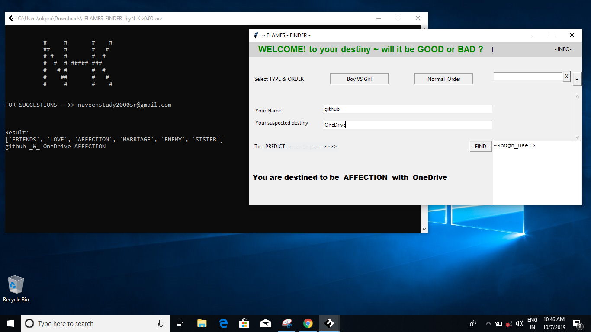
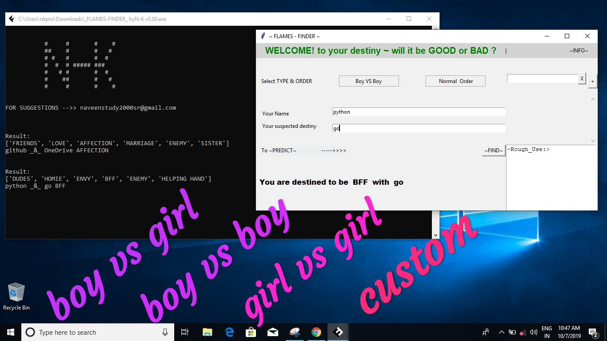
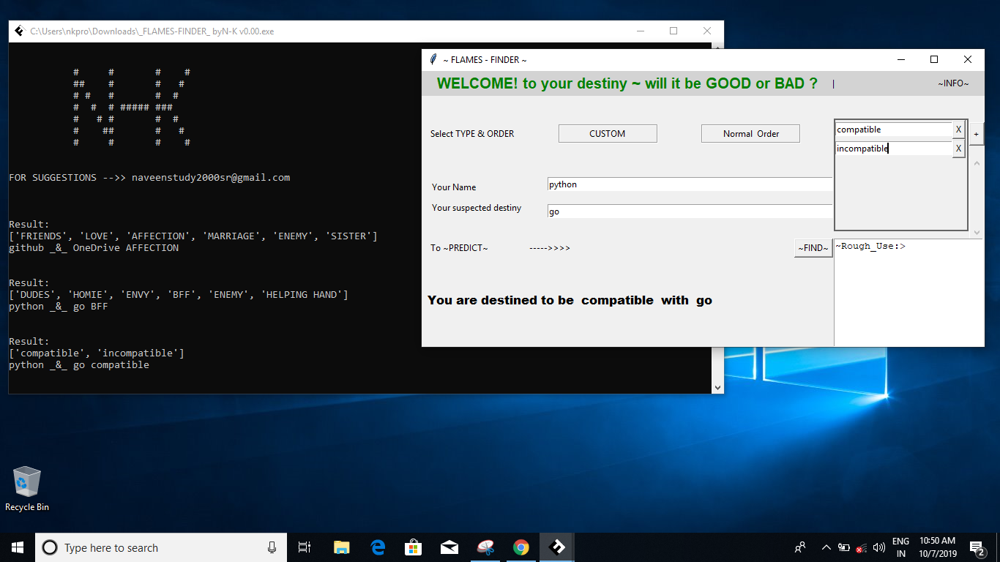
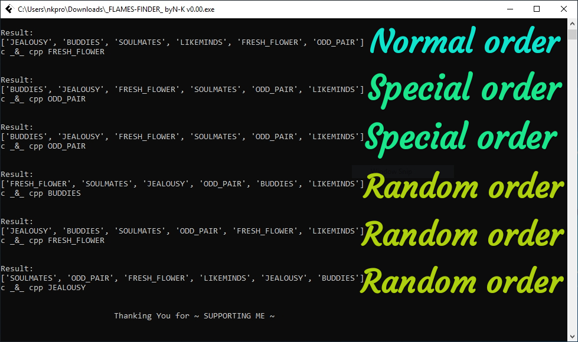

# FlamesFinder_GUI
Game (prediction) just for fun.
predict relation between two people irrespective of their gender,
next level of FLAMES.

HowToPlay: https://medium.com/@ritwika285/how-to-play-flames-game-890edc7bf3d

it also supports custom relations and many modes (order,special,random).

custom -> we can set relations and its order.

Mode> order -> relations list in order.

Mode> special -> shuffled each time of starting executable.

Mode> random -> shuffled each time of finding relation.

Licensed under the [MIT License](LICENSE.md)

Flames not only for LOVERS...
it is just a game.

accoding to me it is a function with two names as parameters
and returns index of our collection.

def Flames(name1:"String", name2:"String", n:"Integer length of collection") -> "index: Integer index of collection" :
    #this_code
